# Lab 06: Configuration Management - Ansible
> Authors : Curchod Bryan - Muaremi Dejvid    
> Professor : Graf Marcel   
> Assistants : Gardel Bastian   
> Date : 16.05.2019

## Task 1: Install Ansible

To install on Linux: Use Python's package manager pip, a good practice would be to use a virtual environnement for this :

```
virtualenv --python=/usr/bin/python ansible
source ansible/bin/activate
sudo pip install ansible
```
__Remarks :__ Ansible only works with python2 and not with python3 so make sure you're using the good one with `python --version`.

Verify that Ansible is installed correctly by running:

```
ansible --version
```

You should see output similar to the following:

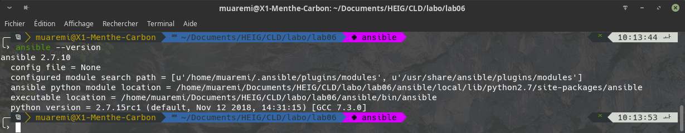


## Task 2: Create a VM on Amazon Web Services

In this task we will create a VM on Amazon Web Services that will be managed by Ansible.

We switch the AWS console to the N. Virginia region to avoid resource limitations. Then we create and download the public/private key pair for this region.
We also create a security group that allows incoming SSH, HTTP and HTTPS traffic from anywhere (0.0.0.0/0).

Then we create an EC2 instance with the following characteristics:
```
Ubuntu Server 14.04 LTS
t2.micro
all other parameters at default value
```
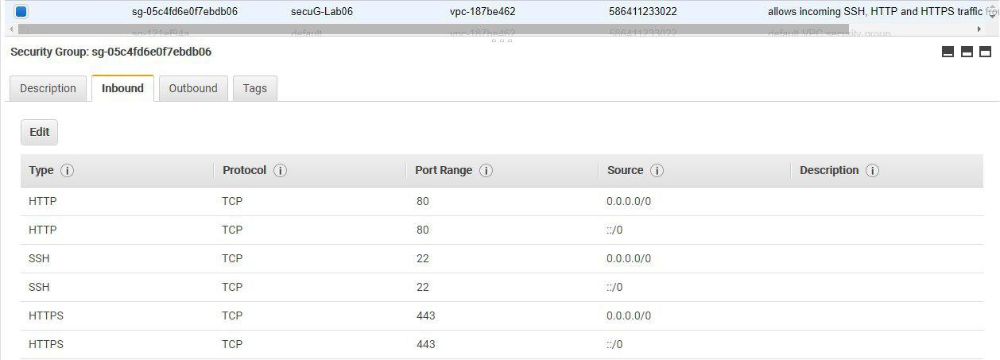

After launching make sure you can SSH into the VM using your private key.
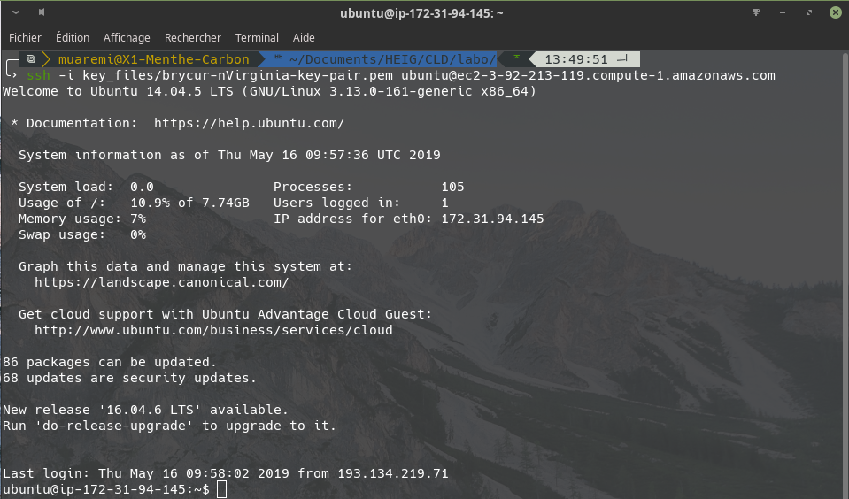


# Task 3: Configure Ansible to connect to the managed VM

In this task we will tell Ansible about the machines it shall manage.

We use a directory called playbooks for this. In this directory we create a file called hosts which will serve as the inventory file.

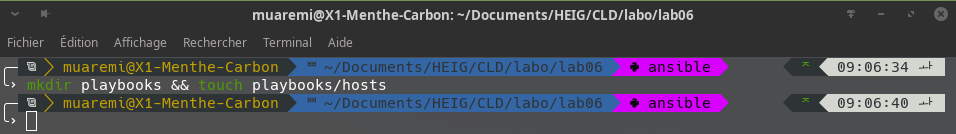

Then we added the following instructions in the file. We have broken the file contents up across multiple lines so that it fits on the page, but it is all on one line in our file, without any backslashes.

```
testserver ansible_ssh_host=3.92.213.119 \
ansible_ssh_user=ubuntu \
ansible_ssh_private_key_file=./key_files/brycur-nVirginia-key-pair.pem
```

__Remarks :__ There's a linux security about the keyfiles. Only the current user must have the privileges to use it, so the privelege have to be `600`. This can be done with `chmod 600 <key_file>.pem`.

To verify that you can use Ansible to connect to the server:

```
ansible testserver -i hosts -m ping
```

You should see output similar to the following:

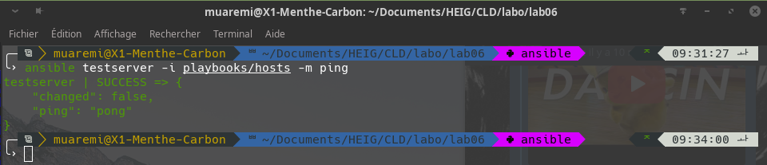


We can now simplify the configuration of Ansible by using an ansible.cfg file which allows us to set some defaults.

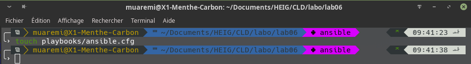

In the file ansible.cfg we have :

```
[defaults]
hostfile = hosts
remote_user = ubuntu
private_key_file = ./key_files/brycur-nVirginia-key-pair.pem
host_key_checking = false
deprecation_warnings = false
```

Among the default options we also disable SSH's host key checking. This is convenient when we distroy and recreate the managed server (it will get a new host key every time). In production this may be a security risk.
We also disable warnings about deprecated features that the 2.x version of Ansible emits.

With these default values the hosts inventory file now simplifies to:

```
testserver ansible_ssh_host=3.92.213.119
```

We can now run Ansible again and don't need to specify the inventory file any more:

```
ansible testserver -m ping
```

You should see output similar to the following:
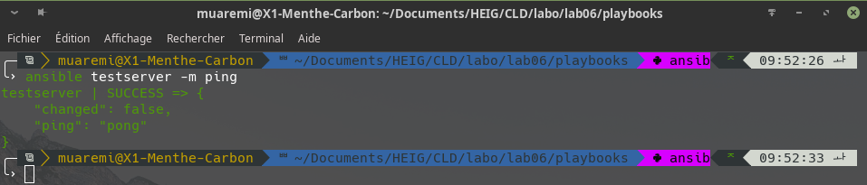

The ansible command can be used to run arbitrary commands on the remote machines. Use the -m command option and add the command in the -a option. For example to execute the uptime command:
```
ansible testserver -m command -a uptime
```
You should see output similar to this:

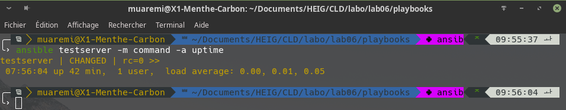

# Task 4: Install web application

In this task we will configure the managed host to run an nginx web server. This will necessitate four files:

- The inventory file from the previous task (playbooks/hosts).
- A playbook with instructions what to configure (playbooks/web.yml).
- The configuration file for nginx (playbooks/files/nginx.conf).
- A template for the home page of our web site (playbooks/templates/index.html.j2).

To make our playbook more generic, we will refer to our managed server not by its individual name, but we will create a group called webservers and put our server into it. We can then later easily add more servers which Ansible will configure identically.

We modify the file playbooks/hosts by adding a definition of the group webservers, which for the time being contains exactly one server, testserver:

```
[webservers]
testserver ansible_ssh_host=52.23.169.86 
```

You should now be able to ping the webservers group:

```
ansible webservers -m ping
```

You should see output similar to this:

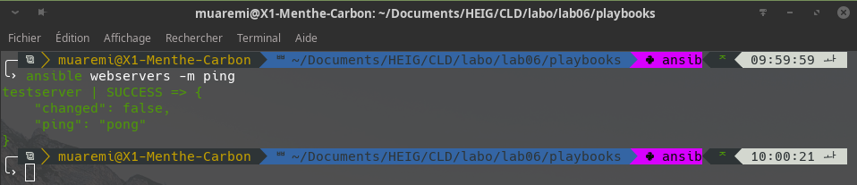

Then we create a playbook named playbooks/web.yml:


Which contains :
```
- name: Configure webserver with nginx
  hosts: webservers
  sudo: True
  tasks:
    - name: install nginx
      apt: name=nginx update_cache=yes
    - name: copy nginx config file
      copy: src=files/nginx.conf dest=/etc/nginx/sites-available/default
    - name: enable configuration
      file: >
        dest=/etc/nginx/sites-enabled/default
        src=/etc/nginx/sites-available/default
        state=link
    - name: copy index.html
      template: src=templates/index.html.j2 dest=/usr/share/nginx/html/index.html mode=0644
    - name: restart nginx
      service: name=nginx state=restarted
```

The playbook references the configuration file for nginx. Create the file playbooks/files/nginx.conf:
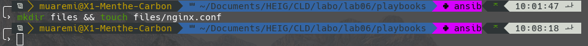
Which contains :
```
server {
    listen 80 default_server;
    listen [::]:80 default_server ipv6only=on;

    root /usr/share/nginx/html;
    index index.html index.htm;

    server_name localhost;

    location / {
        try_files $uri $uri/ =404;
    }
}
```

The configuration file tells nginx to serve the homepage from index.html. We'll use Ansible's template functionality so that Ansible will generate the file from a template.

First, we need to create the template file playbooks/templates/index.html.j2:

Which contains :
```
<html>
  <head>
    <title>Welcome to ansible</title> </head>
  <body>
    <h1>nginx, configured by Ansible</h1>
    <p>If you can see this, Ansible successfully installed nginx.</p>
    <p>{{ ansible_managed }}</p>
  </body>
</html>
```

Now you can run the newly created playbook to configure nginx on the managed host. The command to run playbooks is ansible-playbook:
```
ansible-playbook web.yml
```

This should produce output similar to the following:

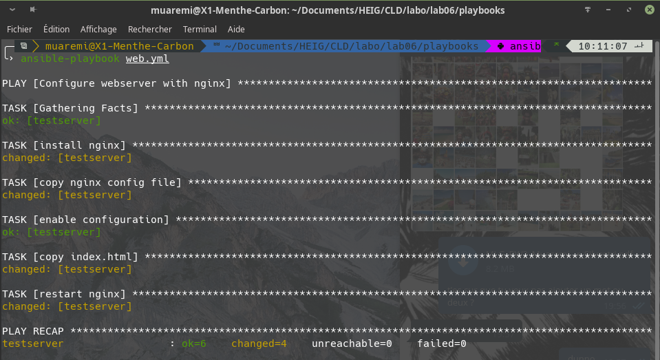

You can then test the new web site by pointing your browser to the address of the managed server. You should see the homepage showing "nginx, configured by Ansible".


# Task 5: Test Desired State Configuration principles

#TODO : Bryanthings... : commenter les TASK [ blablabla ]

In this task we will do some tests to verify that Ansible implements the principles of Desired State Configuration.

According to this principle, before doing anything, Ansible should establish the current state of the managed server, compare it to the desired state expressed in the playbook, and then only perform the actions necessary to bring the current state to the desired state.

In its ouput Ansible marks tasks where it had to perform some action as changed whereas tasks where the actual state already corresponded to the desired state as ok.

## Return to the output of running the web.yml playbook the first time.

__There is one additional task that was not in the playbook.__
  - TASK [Gathering Facts] look at the server and the playbook and compare them

__Among the tasks that are in the playbook there is one task that Ansible marked as ok.__
- TASK [enable configuration] 

__Do you have a possible explanation?__

## Re-run the web.yml playbook a second time. In principle nothing should have changed. 
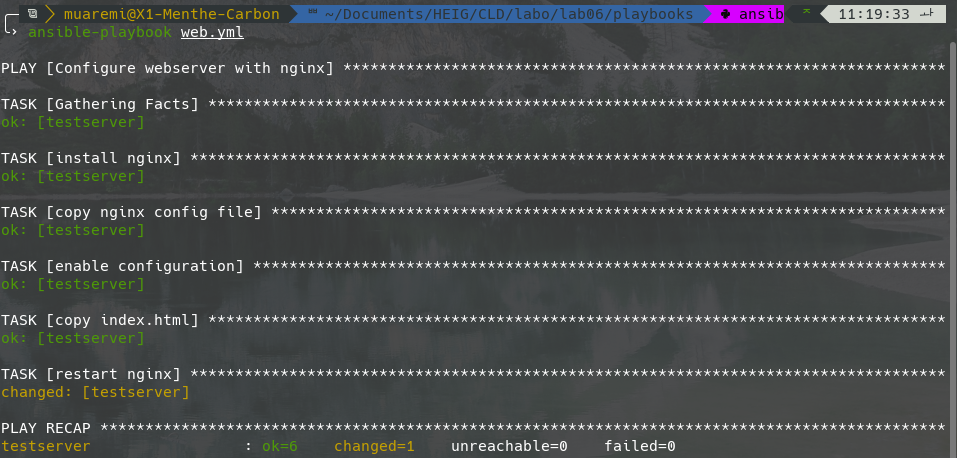
__Compare Ansible's output with the first run. Which tasks are marked as changed?__
- TASK [restart nginx]

## SSH into the managed server. Modify the nginx configuration file /etc/nginx/sites-available/default, for example by adding a line with a comment. Re-run the playbook. 
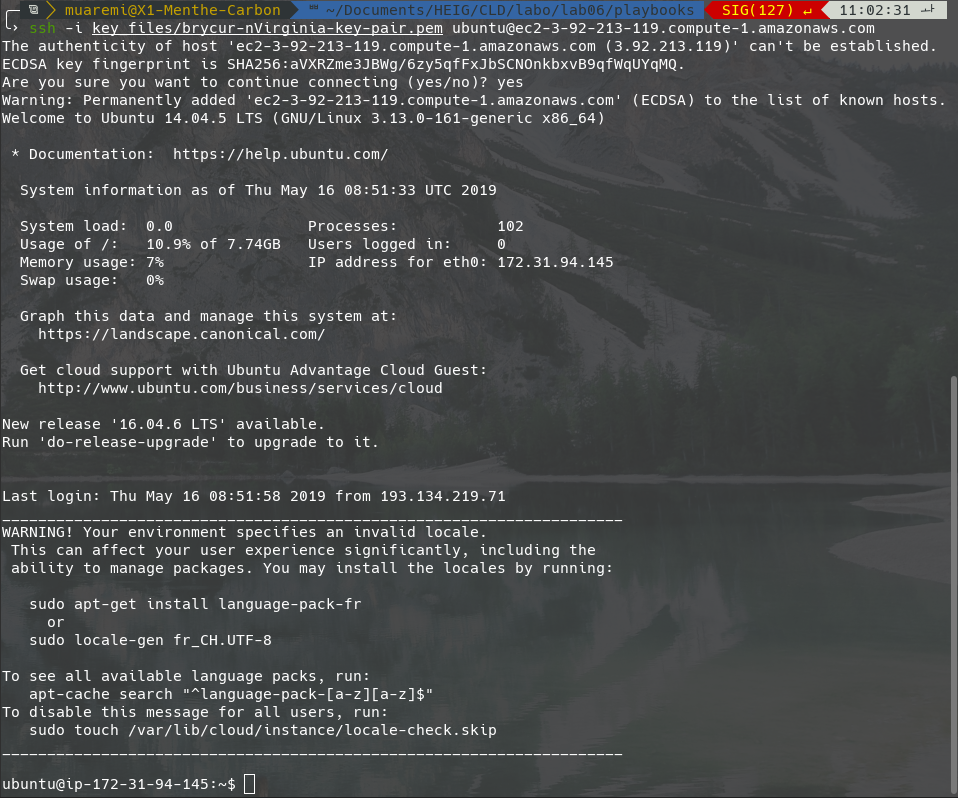
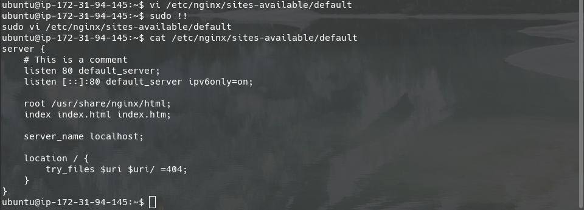
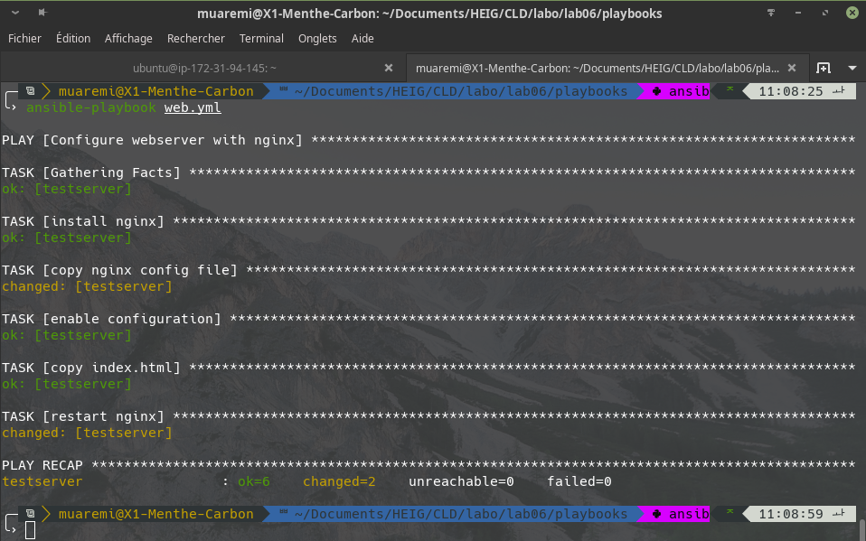
__What does Ansible do to the file and what does it show in its output?__
- TASK [copy nginx config file] replace the nginx.conf file
- TASK [restart nginx] restart the nginx server


## Do something more drastic like completely removing the homepage and repeat the previous question.

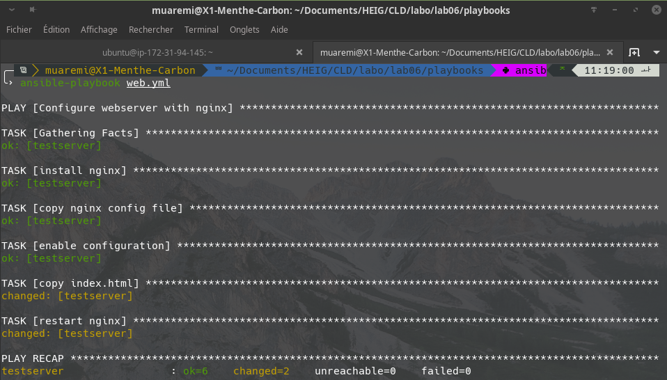
- TASK [copy index.html] Reset the index.html file
- TASK [restart nginx] Restart the nginx server

__Remark :__ As we can see it on the last question, the nginx server is always restarted even when we just change an html file. This is not a good behaviour and we will change it in the next task.


# Task 6: Adding a handler for nginx restart

In this task we will improve the playbook by restarting nginx only when needed.

The current version of the playbook restarts nginx every time the playbook is run, just in case something in nginx's configuration changed that the running nginx process needs to pick up.

By putting the nginx restart not into a task, but into a handler, its execution can be made conditional. What we want is that nginx is only restarted if one of the tasks that affects nginx's configuration had a change.

Following the the Ansible documentation about handlers, we modified the playbook so that the nginx restart becomes a handler and the tasks that potentially modify its configuration use notify to call the handler when needed. The playbook is now the following :

```
- name: Configure webserver with nginx
  hosts: webservers
  sudo: True
  tasks:
    - name: install nginx
      apt: name=nginx update_cache=yes
    - name: copy nginx config file
      copy: src=files/nginx.conf dest=/etc/nginx/sites-available/default
      notify:
        - restart nginx
    - name: enable configuration
      file: >
        dest=/etc/nginx/sites-enabled/default
        src=/etc/nginx/sites-available/default
        state=link
    - name: copy index.html
      template: src=templates/index.html.j2 dest=/usr/share/nginx/html/index.html mode=0644
  handlers:  
      - name: restart nginx
        service: name=nginx state=restarted
```
This should produce output similar to the following:
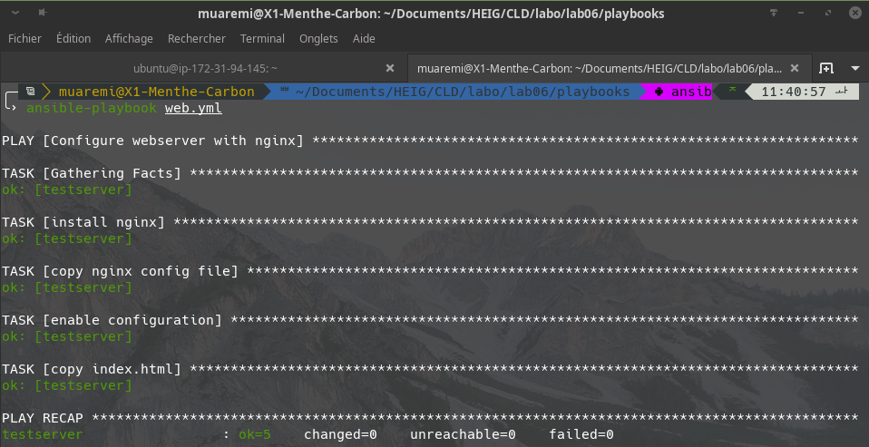
__Remarks :__ Note that the task TASK [restart nginx] hasn't been launched. 

# Task 7: Add more managed servers

In this task We will add more managed servers that will be configured by the same playbook.

In AWS, we create another EC2 instance using the same parameters as before. Then we add the IP address of that instance to the webservers group in the playbooks/hosts inventory file.

```
testserver ansible_ssh_host=3.92.213.119
[webservers]
testserver1 ansible_ssh_host=3.92.213.119
testserver2 ansible_ssh_host=54.89.130.0
```

Re-run the web.yml playbook. What do you observe in Ansible's output?
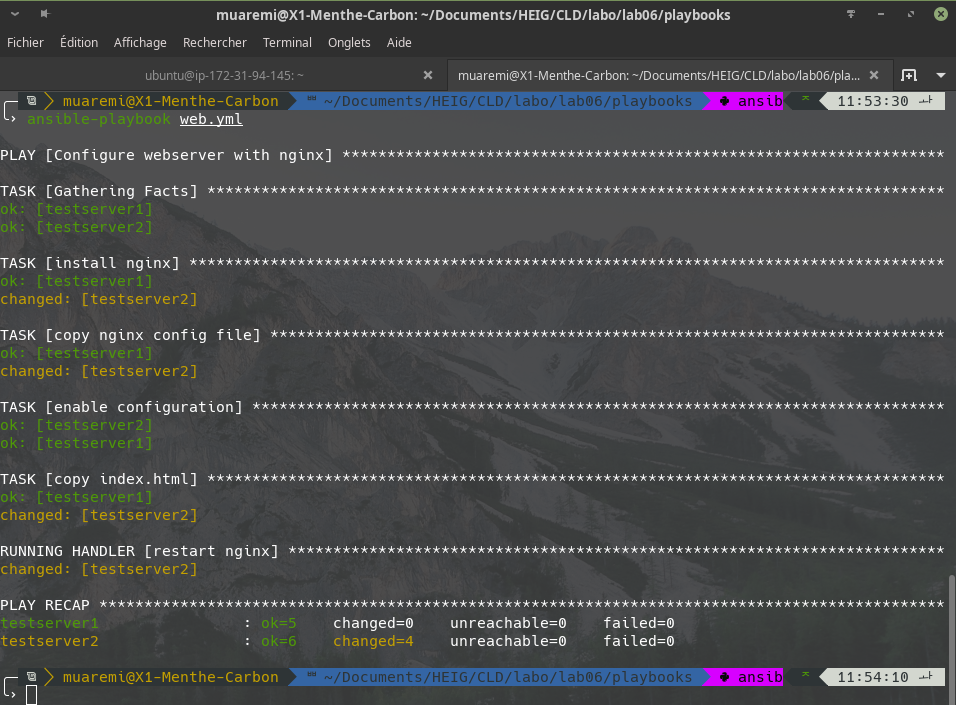

Test the new server by pointing your web browser to it.


What happens if a server is not reachable? Shut down the second instance and re-run the playbook.
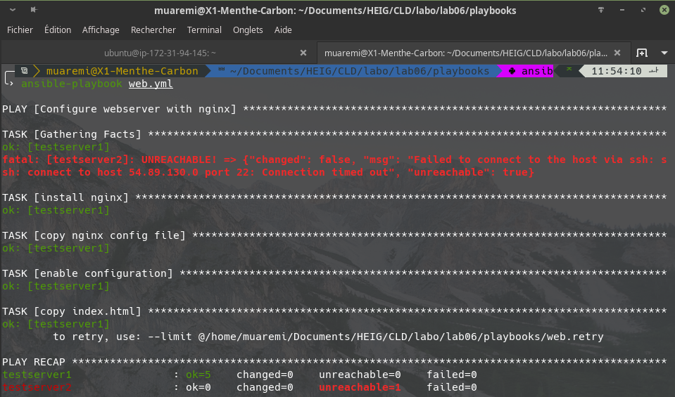


Suppose you now have 10 web servers in production that you have configured using Ansible. You are working in the IT department of a company and some of your system administrator colleagues who don't use Ansible have logged manually into some of the servers to fix certain things. You don't know what they did exactly. What do you need to do to bring all 10 servers again to the initial state? We'll exclude drastic changes by your colleagues for this question.

#TODO : Bryanthings...
Genre si tu run ansible-playbook ... ça devrait les reset non ?
 - Visiblement ça check l'état courant / attendu et ça fait les changements

Il faut chercher une autre solution (plus propre)
 - Bastien : Je croix que c'est ailleurs. Mais demande plutôt au prof
